<p align="center">
  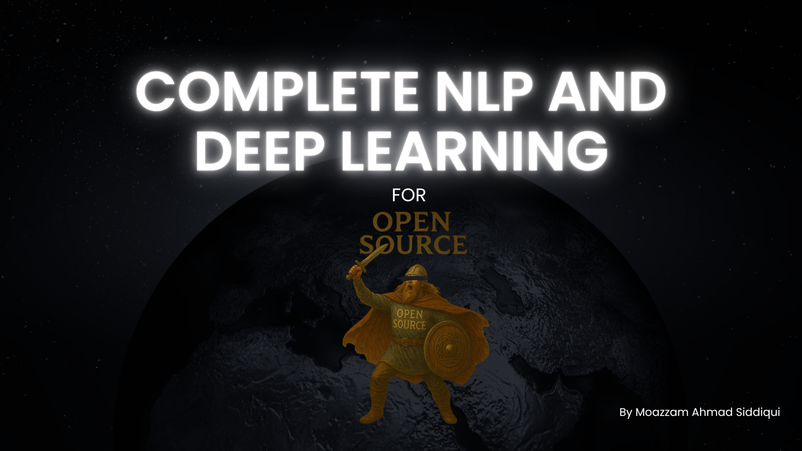
</p>  

<hr>


<p align="center">
  
  
  
  
  
  
</p>

## 📑 Table of Contents

1. [🧹 Cleaning the Input](#-cleaning-the-input)
2. [🔡 Converting Text to Vectors](#-converting-text-to-vectors)
3. [🤖 Deep Learning Techniques](#-deep-learning-techniques)
4. [💡 Use Cases of NLP](#-use-cases-of-nlp)
5. [✂️ Tokenization](#️-tokenization)
6. [📚 WordNet Lemmatizer](#-wordnet-lemmatizer)
7. [🧍‍♂️ Named Entity Recognition (NER)](#️-named-entity-recognition-ner)
8. [🔧 Basic Steps of Preprocessing](#-basic-steps-of-preprocessing)
9. [🔢 One-Hot Encoding (OHE)](#-one-hot-encoding-ohe)
10. [🧠 Bag of Words (BoW) Representation](#-bag-of-words-bow-representation)
11. [🔗 N-Grams](#-n-grams)
12. [🧮 TF–IDF (Term Frequency – Inverse Document Frequency)](#-tfidf-term-frequency--inverse-document-frequency)
13. [🧩 Word Embeddings](#-word-embeddings)
14. [🔄 SkipGram](#-skipgram)
15. [✅ Advantages of Word2Vec](#-advantages-of-word2vec)
16. [🤖 Deep Learning & Neural Networks](#-deep-learning--neural-networks)
17. [🔁 Sequential Data](#-sequential-data)
18. [⚙️ Why Prefer ANN over RNN?](#️-why-prefer-ann-over-rnn)
19. [🧠 Simple RNN (Recurrent Neural Network)](#-simple-rnn-recurrent-neural-network)
20. [🔙 RNN Back Propagation With Time](#-rnn-back-propagation-with-time)
21. [🧩 Simple ANN and RNN Projects](#-simple-ann-and-rnn-projects)
22. [🏗️ Building a Neural Network](#️-building-a-neural-network)
23. [🧠 Some Keywords within Neural Nets](#-some-keywords-within-neural-nets)
24. [⚙️ Optimizers](#️-optimizers)
25. [🧮 Loss Function](#-loss-function)
26. [🚫 Why ANN Isn’t Used Instead of RNN](#-why-ann-isnt-used-instead-of-rnn)
27. [🧠 LSTM (Long Short-Term Memory)](#-lstm-long-short-term-memory)
28. [💡 Conceptual Breakdown: RNN vs. LSTM](#-conceptual-breakdown-rnn-vs-lstm)
29. [🧱 LSTM Architecture Explained (Beginner + Technical)](#-lstm-architecture-explained-beginner--technical)
30. [🧩 Variants of LSTM RNN](#-variants-of-lstm-rnn)
31. [⚙️ Why use GRU instead of LSTM RNN?](#️-why-use-gru-instead-of-lstm-rnn)
32. [🧮 Mathematical Functioning (GRU)](#-mathematical-functioning-gru)
33. [🧠 Understanding What Each State Does (GRU)](#-understanding-what-each-state-does-gru)
34. [🕰️ Chronology Samjhiye (Understand the Chronology)](#-chronology-samjhiye-understand-the-chronology)


# Natural Language Processing (NLP) — Text Preprocessing & Vectorization

---

## 🧹 CLEANING THE INPUT

### 🧾 Text Preprocessing
- **Tokenization:** Technique to change paragraph → sentence → words (called as *token*).  
- **Lemmatization:** Technique to find lemma (context) of a word.  
- **Stemming:** Technique to find stem (root) of a word.

---

## 🔡 CONVERTING TEXT TO VECTORS

### 🧩 Text Preprocessing — Part 2
Converting text data into numerical vectors.  
**Techniques Used:**  
- Bag of Words (BOW)  
- TF-IDF  
- Unigram  
- Bigram  

### 🧠 Text Preprocessing — Part 3
- Word2Vec  
- AvgWord2Vec  

---

## 🤖 DEEP LEARNING TECHNIQUES

### 🧬 Neural Networks
- RNN  
- LSTM-RNN  
- GRU-RNN  

### 🧱 Word Embeddings: 
Transformer, BERT , GPT  

**Libraries:**  
- NLTK, SpaCy for ML  
- TensorFlow, PyTorch for DL  

---

## 💡 USE CASES OF NLP
- Auto Correct  
- Auto-Generated text for email  
- Auto-Reply (LinkedIn, WhatsApp, etc.)  
- Google Translate  
- Image Search (Google Images)  
- Hugging Face Models  

---

## ✂️ TOKENIZATION

**Definition:**  
A process in which we take either Corpus or Documents and convert them into Tokens,which basically do Corpus to Documents,Documents to words.

**Concepts:**
1. Corpus (paragraphs)  
2. Documents (sentences)  
3. Vocabulary (unique words in documents)  
4. Words (all words in corpus)

[For Tokeization Files](https://github.com/Moazzam-Siddiqui/COMPLETE-NLP-AND-DEEP-LEARNING/tree/main/Text%20PreProcessing)


**FOR UNIQUE WORDS OR VOCABULARY COUNT:-**  
 Also counting Unique words(words that aren't repeated,if it is written once and appears again we will no count that word again in our word)

So if I were to do classifications of words for like checking spam or ham,good reviews or bad reviews,etc I can use Tokenization,Stemming and Lemmatization combining them to make our model understand betterly, like if I were to classify a email in spam or ham the first step is to look out for corpus or paragraphs then convert them to either docs(sentences) or words then correcting the words using Lemmatization or Stemming and finally smartly allow our model to classify them using ML models,there are some disadvantages of using Stemming cuz sometimes it classify words badly increasing error chances so we use Lemmatization.


---

### ⚙️ Example: Spam/Ham Classification
To classify emails (spam/ham) or reviews (good/bad):
1. Tokenize corpus → documents → words.  
2. Apply Lemmatization / Stemming to clean data.  
3. Use ML models for classification.  


**Note:** Stemming can sometimes misclassify words, so Lemmatization is often preferred.

---

## STEMMING 

**Definition:**
Stemming is the process of reducing a word to its base or root form (called the stem), by removing prefixes or suffixes.

**✅ Example:**

"running", "runs", "ran" → "run"

"studies", "studying" → "studi" (note: not always a valid word)

**📘 Purpose:**
Used in Natural Language Processing (NLP) to group words with the same meaning or concept together, improving search, text classification, and information retrieval.

**🧠 Common Algorithm:**

Porter Stemmer — one of the most widely used stemming algorithms.

[For Stemming File](https://github.com/Moazzam-Siddiqui/COMPLETE-NLP-AND-DEEP-LEARNING/tree/main/Text%20PreProcessing)


## 📚 WORDNET LEMMATIZER

**Definition:**  
Lemmatization gives the valid *root form* (lemma) of a word.  
Unlike stemming, output words are valid and meaningful.

Lemmatization technique is like stemming. The output we will get after lemmatization is called
lemma', which is a root word rather than root stem, the output of stemming. After lemmatization,
we will be getting a valid word that means the same thing.

NLTK provides WordNetLemmatizer class which is a thin wrapper around the wordnet corpus. This
class uses morphy() function to the WordNet CorpusReader class to find a lemma.

lemmatizer takes more time as compared to stemming cuz it uses morphy() function,it's use cases can be Q&A,chatbot,text summarization,etc.


**Library:**  
`WordNetLemmatizer` from **NLTK** uses the WordNet corpus via `morphy()`.

**Use Cases:**  
- Chatbots  
- Text Summarization  
- Q&A Systems  

[For Lemmetization File](https://github.com/Moazzam-Siddiqui/COMPLETE-NLP-AND-DEEP-LEARNING/tree/main/Text%20PreProcessing)


---

## 🧍‍♂️ NAMED ENTITY RECOGNITION (NER)

A way of NLTK of RECOGNITION names,organization,company,location,etc using pos tags or NER identifies **names, organizations, locations, and companies** using POS tags.  
Example: “Apple” → *Organization*, “India” → *Location*

[For NER File](https://github.com/Moazzam-Siddiqui/COMPLETE-NLP-AND-DEEP-LEARNING/tree/main/Text%20PreProcessing)


---

## 🔧 BASIC STEPS OF PREPROCESSING

**Step 1:** Dataset

**Step 2:**  
    1.Tokenize.
    2.lowercase all value to sort out common words not making them Unique(for example:- "The" || "the")
    3.Regular Expression(removing special characters)

**Step 3:**  
- Stemming  
- Lemmatization  
- Stopword removal

**Step 4:**  
After these we try to convert our text data to vectors,VECTORS are basically our numerical representation of our text data,it can be word it can be sentence,it can be paragraph.

---

## 🔢 ONE-HOT ENCODING (OHE)

One of the Text to Numeric Techniques

**Example:**

Let's say our Vocabulary has → [The, Food, Is, Good, Bad, Pizza, Amazing]

D1 = The food is good
D2 = The food is bad
D3 = Pizza is amazing

now if we make matrix of each sentence

**Matrix Representation:**

D1:

| Word | One-Hot Vector |
|------|----------------|
| The |  [1,0,0,0,0,0,0] |
| Food | [0,1,0,0,0,0,0] |
| Is |   [0,0,1,0,0,0,0] |
| Good | [0,0,0,1,0,0,0] |

D2:

| Word | One-Hot Vector |
|------|----------------|
| The | [1,0,0,0,0,0,0]|
| Food | [0,1,0,0,0,0,0]|
| Is |  [0,0,1,0,0,0,0]|
| Good | [0,0,0,0,1,0,0]|

D3:

| Word    | Vector              |
|:--------|:--------------------|
| Pizza   | `[0,0,0,0,0,1,0]`   |
| is      | `[0,1,0,0,0,0,0]`   |
| Amazing | `[0,0,0,0,0,0,1]`   |

**Advantages:**
- Easy to implement (`sklearn.OneHotEncoder`, `pandas.get_dummies()`)

**Disadvantages:**
-.Sparse Matrix - Overfitting ('Very good accuracy with training data but not with new data')
- For ML algorithm we need fixed size but in OHE we can't get it here
- No semantic meaning is getting captured
- Out of Vocabulary

---

## 🧠 Bag of Words (BOW) Representation

**Definition:**
Bag of Words (BOW) is a simple and widely used text representation technique in Natural Language Processing (NLP).  
It converts text into numerical form by representing each sentence or document as a **set of words** (ignoring grammar and word order), and using either **binary values** (1 or 0) or **word frequencies** to indicate the presence or count of each word.

First step is to lower all the words and then use Stopwords.

When we words like basic Vocabulary (he, she, a, is, the, are, etc) it will be ignored cause it doesn't have any sentimental analysis.

For example:-

| Original Sentence | After Removing Stopwords |
|--------------------|--------------------------|
| He is a good boy | good boy |
| She is a good girl | good girl |
| Boy and Girl are Good | Boy Girl Good |

---

### Vocabulary and Frequency

| Vocabulary | Frequency |
|-------------|------------|
| good | 3 |
| boy | 2 |
| girl | 2 |

---

### Sentence Representation

| Sentence | Vector (good, boy, girl) | O/P |
|-----------|---------------------------|-----|
| S1 -> good boy | [1, 1, 0] | 1 |
| S2 -> good girl | [1, 0, 1] | 1 |
| S3 -> Boy Girl Good | [1, 1, 1] | 1 |

---
### Advantages of BOW :-

1.Simple and Intuitive
2.Fixed Size I/P - For ML algorithm

### Disadvantages of BOW:-

1.Sparse Matrix or array -> Overfitting
2.Ordering of the word is getting changed
3.Out of Vocabulary
4.semantic meaning is still not getting captured


### Binary BOW
Binary BOW: {1 and 0}

### Frequency BOW
BOW: {count will be updated based on frequency}

[For Bag of Word File](https://github.com/Moazzam-Siddiqui/COMPLETE-NLP-AND-DEEP-LEARNING/tree/main/Text%20PreProcessing)

---

## 🔗 N-GRAMS

Combines words to form pairs/triples for context.

Example:


| Vocabulary | Note |
|-------------|------|
| food, not, good | *(“the” and “is” are not present because we have removed them using stopwords)* |

| Sentence | Vector (food, not, good) |
|-----------|--------------------------|
| S1 → The food is good | [1, 0, 1] |
| S2 → The food is not good | [1, 1, 1] |


let's say from S1 we are going to make combination :-
**Bigrams (combination of two words):** food-good, food-not, not-good  
You can clearly see the difference between the vectors.  
Wherever the combination matches, we can represent it with `1`.

### For S1:
| Combination | Vector |
|--------------|---------|
| food not good | 1 |
| food good | 0 |
| food not | 1 |
| not good | 0 |

---

### For S2:
| Combination | Vector |
|--------------|---------|
| food not good | 1 |
| food good | 1 |
| food not | 0 |
| not good | 1 |

sklearn → n-gram= (1,1) → unigrams
  = (1,2) → unigram, bigram
  = (1,3) → unigram, bigram,trigram
  = (2,3) → Bigram, trigram.


**Why use N-Grams?**
-   cuz it is giving us better contextial and semantic meaning of the words, better than it's predecessor BOW.

---

## 🧮 TF–IDF (Term Frequency – Inverse Document Frequency)

S1 → good boy  
S2 → good girl  
S3 → boy girl good  

**TF (Term Frequency):** No. of repetitions of words / No. of words in the sentence  
**IDF (Inverse Document Frequency):** logₑ(No. of sentences / No. of sentences containing the word)

---

### 📊 Term Frequency (TF) and Inverse Document Frequency (IDF)

**TF–IDF (Term Frequency – Inverse Document Frequency)** is a numerical statistic used in **Natural Language Processing (NLP)** and **Information Retrieval** to measure how important a word is to a document in a collection or corpus.


| Word | S1 | S2 | S3 | IDF |
|------|----|----|----|-----|
| good | 1/2 | 1/2 | 1/3 | logₑ(3/3) = 0 |
| boy  | 1/2 | 0 | 1/3 | logₑ(3/2) |
| girl | 0 | 1/2 | 1/3 | logₑ(3/2) |

---

### ⚙️ TF × IDF (Final TF–IDF Matrix)

| Sentence | good | boy | girl |
|-----------|------|-----|------|
| S1 | 0 | 1/2 × logₑ(3/2) | 0 |
| S2 | 0 | 0 | 1/2 × logₑ(3/2) |
| S3 | 0 | 1/3 × logₑ(3/2) | 1/3 × logₑ(3/2) |

---

### ✅ Advantages of TF–IDF
1. Intuitive  
2. Inputs are fixed size → Vocabulary size  
3. Word importance is captured effectively  

---

### ⚠️ Disadvantages of TF–IDF
1. Sparse matrix  
2. Out-of-vocabulary issue  


[For  TF-IDF Files](https://github.com/Moazzam-Siddiqui/COMPLETE-NLP-AND-DEEP-LEARNING/tree/main/Text%20PreProcessing)


---

# 🧠 Word Embeddings

### 📖 Definition (Wikipedia)
In **Natural Language Processing (NLP)**, **word embedding** is a term used for representing words for text analysis — typically in the form of a **real-valued vector** that encodes the meaning of a word.  
Words that are **closer in the vector space** are expected to be **similar in meaning**.

---

## 🧩 Word Embedding Techniques

1. **Count or Frequency-based Methods:**  
   - OHE (One Hot Encoding)  
   - BOW (Bag of Words)  
   - TF-IDF  

2. **Deep Learning-based Methods:**  
   - Word2Vec  

---

## 🧠 Word2Vec Types

1. **CBOW (Continuous Bag of Words)**  
2. **Skip-Gram**

---

## 🔍 About Word2Vec

**Word2Vec** is a technique for NLP introduced in 2013.  
It uses a **neural network model** to learn word associations from a large corpus of text.  

Once trained, the model can:
- Detect **synonymous words**
- Suggest additional words for incomplete sentences  

Each word is represented by a list of numbers called a **vector**.

---

## 🧾 Example Vocabulary

**Vocabulary:**  
Boy, Girl, King, Queen, Apple, Mango  

Each word in the vocabulary is converted into a **feature representation vector** based on attributes (like Gender, Age, Royal, Food, etc.).  
If we assume there are `n` such features, each word will have `n` dimensions (e.g., 300).

| Feature | Boy | Girl | King | Queen | Apple | Mango |
|----------|-----|------|------|--------|--------|--------|
| Gender | 1 | -1 | -0.92 | 0.93 | -0.01 | 0.01 |
| Royal | 0.01 | 0.02 | -0.95 | 0.96 | -0.01 | 0.01 |
| Age | 0.03 | 0.02 | 0.75 | 0.68 | -0.95 | 0.96 |
| Food | - | - | - | - | -0.99 | 0.99 |
| ... | ... | ... | ... | ... | ... | ... |
| nth | - | - | - | - | - | - |

> Feature representations can extend to hundreds or thousands of dimensions.

---

## ✴️ Famous Word2Vec Calculation

A well-known example from Google’s research:

[Embedding Folder](https://github.com/Moazzam-Siddiqui/COMPLETE-NLP-AND-DEEP-LEARNING/tree/main/Embedding)


---

## 🔄 SkipGram

**Definition:**  
SkipGram is just the **opposite of CBOW**.  
While CBOW predicts the **target word** based on **context words**,  
SkipGram predicts **context words** based on a **target word**.

---

### 🧩 Example
**Window Size = 5**

| O/P (Context Words) | I/P (Target Word) |
|----------------------|-------------------|
| iNeuron, company, related, to | is |
| company, related, to, Data | related |
| related, to, Data, Science | to |

---

### ⚙️ When to Use CBOW vs SkipGram

| Dataset Size | Recommended Model |
|---------------|-------------------|
| Small dataset | **CBOW** |
| Large dataset | **SkipGram** |

---

### 💡 Notes

1. To improve CBOW or SkipGram performance, **increase the training data**.  
2. **Increasing window size** also increases **vector dimensions**.  
   > Larger window → larger vector dimension → richer context representation

---

## ✅ Advantages of Word2Vec

1. Produces **dense matrices** instead of sparse ones.  
2. **Captures semantic information** effectively.  
3. Provides a **fixed set of dimensions** for all words.  
4. Only a few words fall **Out of Vocabulary (OOV)**.

---

## 🤖 Deep Learning & Neural Networks

### ANN (Artificial Neural Network)

**Overview:**  
An ANN is composed of layers of connected neurons (input layer → one or more hidden layers → output layer). Each connection has a weight; activations travel forward and errors propagate backward during training.

**Basic Components:**
- **Neuron:** computes weighted sum + bias → activation function.  
- **Layers:** Input, Hidden, Output.  
- **Activation functions:** ReLU, Sigmoid, Tanh, Softmax (for classification).  
- **Loss functions:** MSE, Cross-Entropy.  
- **Optimization:** Gradient Descent variants (SGD, Adam).

**Typical Workflow:**
1. Prepare and normalize input data.  
2. Define architecture (layers, units, activations).  
3. Choose loss and optimizer.  
4. Train with mini-batches and validate.  
5. Evaluate on test set and tune hyperparameters.


[ANN Folder](https://github.com/Moazzam-Siddiqui/COMPLETE-NLP-AND-DEEP-LEARNING/tree/main/ANN)

---

For Architectural Working:
<p align="center">
  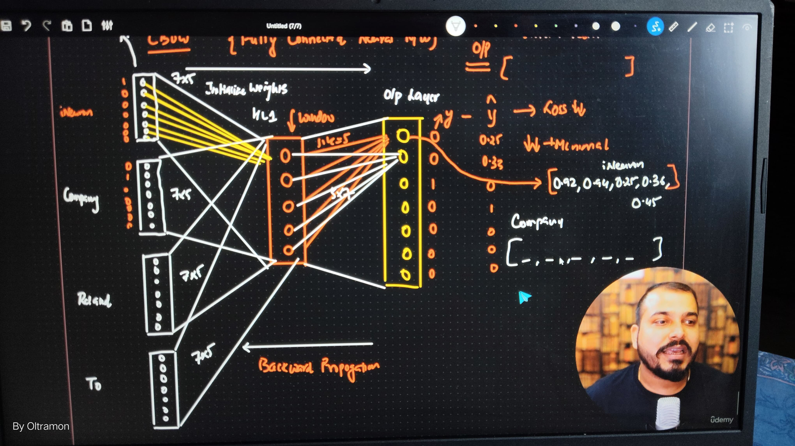
  
  
  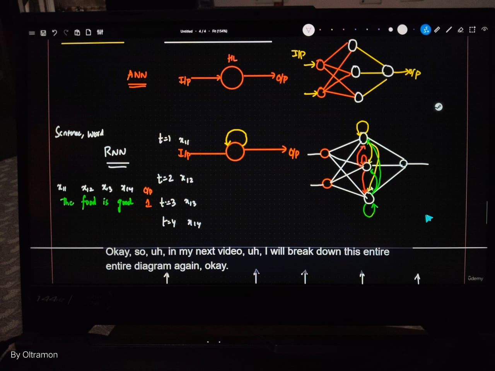
</p>

## 🔁 Sequential Data

1. **Definition:**  
   Sequential data refers to data that has a **meaning or relationship** with its previous inputs.  
   It can be text, time series, or any other form of data where the order matters.  

   **Example:**  
   - Sentence: *“The food is good.”*  
     Here, “GOOD” is predicted based on the previous words (“The food is”), similar to how text generation models work.  
     Even if the next word could be “average” or “bad,” the model learns to make a prediction based on prior context.

---

### 💬 Examples of Sequential Data
2. **Language Translation**  
3. **Auto Suggestions** (LinkedIn, Gmail, etc.)  
4. **Sales Data** – especially when analyzed based on date and time for forecasting.

---

## ⚙️ Why Prefer ANN over RNN?

In short, when generating outputs:  
- The model takes inputs along with **initialized weights**.  
- Adds a **bias**.  
- Applies a **basic activation function** to produce the output.  

While ANNs work on independent data points, RNNs handle **sequential dependencies**, but ANNs are still preferred in some simpler cases where context or time-sequence is not crucial.


## **Simple RNN (Recurrent Neural Network)**

### **Definition:**
A **Recurrent Neural Network (RNN)** is a type of neural network designed to handle **sequential data** — data where the current output depends on previous inputs.  
It has a special structure where the **output from one step is fed back as input to the next step**, allowing the network to remember information over time.

For example:  
In a sentence like *“The food is good”*, the meaning of the word **“good”** depends on the previous words — *“The food is”*.  
RNNs are used for tasks like **text generation**, **speech recognition**, **machine translation**, and **time series forecasting**.

**Key idea:**  
RNN = ANN + Memory (it remembers past information while processing new data)

[Simple RNN Folder](https://github.com/Moazzam-Siddiqui/COMPLETE-NLP-AND-DEEP-LEARNING/tree/main/Simple%20RNN)


---

### **Dataset Example**

| Text | O/P |
|------|-----|
| S1: The food is good | 1 |
| S2: The food is bad | 0 |
| S3: The food is not good | 0 |

The yellow words represent the **vocabulary** or **unique words** in our dataset.

---

### **One-Hot Encoding Representation**

Before sending text data to an RNN, we first convert words into **numerical vectors** using a simple encoding method called **One-Hot Encoding**.

| Word | [The, Food, Good, Bad, Not] |
|------|------------------------------|
| the  | [1, 0, 0, 0, 0] |
| food | [0, 1, 0, 0, 0] |
| good | [0, 0, 1, 0, 0] |
| bad  | [0, 0, 0, 1, 0] |
| not  | [0, 0, 0, 0, 1] |

---

### **Forward Propagation in RNN**

Once the words are encoded, they are fed **one at a time** into the RNN.  
At each **time step**, the RNN processes one word and passes its **hidden state** (memory) to the next step.

This means the network understands **context** and **sequence**, not just isolated words.

Example flow for:  
**“The food is good”**

For BlackBox Understanding:

#### RNN:

<p align="center">
  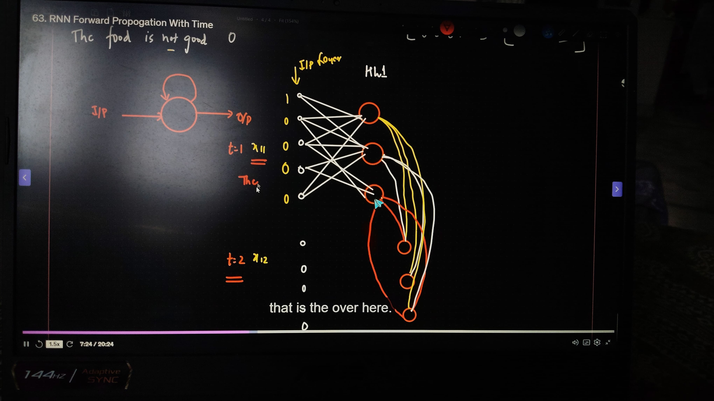
</p>

#### RNN Parameters Calculations:

<p align="center">
  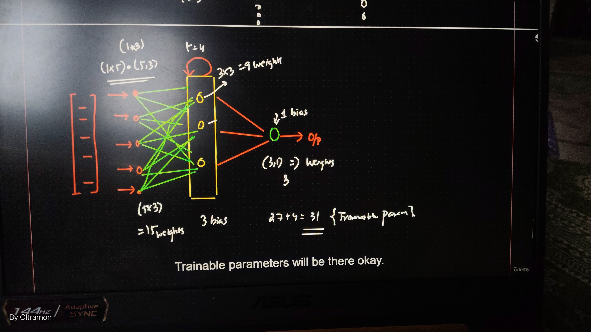
</p>

#### Forward Propagation:

<p align="center">
  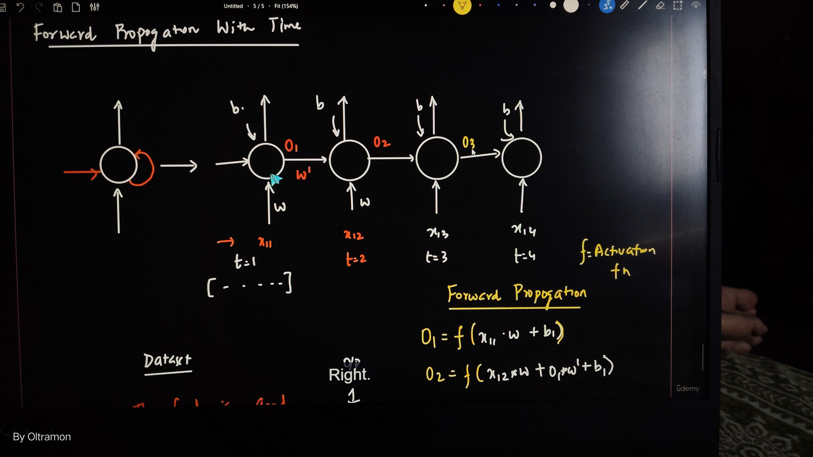
</p>

**Why prefer ANN over RNN:**

So in short, whatever output we are getting after,we probably take the inputs along with the weights that are initialized, then we add a bias then we add a basic activation function

*y = f(x1w1 + x2w2 + … xnwn + b1 … bn)*

y = output  
X = inputs  
W = weights  
B = bias  
F = activation function  

There are many activation functions like sigmoid for binary output, softmax for multiclass classification and ReLu for CNN.

## RNN BACK PROPAGATION WITH TIME:

We've seen how we have calculated our forward propagation but still there is lose function which was  
loss = y - y`.  
So ,to reduce the all that loss we tends to approach backward propagation and we have to update all the weights that are there

[wi, wh ,wo]

And this will happen when our loses will be really really less  or our global minima will be entirely down.

### How we will do that:

We will use the weight update formula ,which is :-

### Weight Updation Formula

We update the weights during backpropagation using the following formula:

w_new = w_old - η * (∂h / ∂w_old)

where,  
- w_new → updated weight  
- w_old → previous weight  
- η (eta) → learning rate  
- ∂h / ∂w_old → gradient of the loss with respect to the old weight

### Simple ANN and RNN Projects

Now we are going to do some simple ANN and RNN projects using libraries like **Keras** and **TensorFlow**.

#### We will do:

1. Take **Churn Modelling Dataset**  
2. Perform **Classification** with basic **Feature Engineering**  
3. Convert **Categorical variables** into **Numerical**  
4. Apply **Standardization**  
5. Then try to **create an ANN**  
6. We will also use **Dropout** (disabling some of the nodes while doing forward and backward propagation)  
   - This helps our model **not to overfit**, as some weights will not be updated.  
7. Use **Optimizers** and **save model files** in `.pickle` or `.h5` formats  

Finally, we will use **Streamlit** for the **deployment** of our web model.
### Building a Neural Network

1. **Sequential Network (N/W)**  
   - Used to build a model layer by layer.

2. **Dense Layer**  
   - Example: 64 neurons  

3. **Activation Functions**  
   - `sigmoid`, `tanh`, `ReLU`, `leaky ReLU`

4. **Optimizer**  
   - Performs **Backpropagation** → updates the weights.

5. **Loss Function**  
   - Measures how far the predicted output is from the actual output.

6. **Metrics**  
   - Example: `[accuracy]`, `[mse, mae]`

7. **Training Process**  
   - Generate **logs** → store in **folders** → visualize with **TensorBoard**

# 🧠 Some Keywords within Neural Nets

### Epochs
In machine learning, an **epoch** means **one full pass through the entire training dataset by the learning algorithm**.

Here’s the breakdown:

- Imagine you have **1,000 training samples**.

- In 1 epoch, your model sees all 1,000 samples once, adjusts weights, and completes a full training cycle.

- If you set epochs=10, the model will see all 1,000 samples 10 times (weights updated after each batch/iteration).

**🔹 Why not just one epoch?**

One pass isn’t enough for the model to learn patterns well. Multiple epochs help it refine and improve accuracy.

Too many epochs → **overfitting** (model memorizes training data instead of generalizing).

### Validation Split:

validation_split is a parameter in Keras/TensorFlow that reserves a fraction of your training data for validation.

Example:

    model.fit(X, y, epochs=10, validation_split=0.2)

This means:

- 80% → training

- 20% → validation

**Purpose:**

Model trains on training part

After each epoch, it tests on validation part

Helps track **overfitting/underfitting**.

**Important Notes:**

Works only if dataset fits in memory (NumPy array / TensorFlow dataset).

Split happens **before shuffling**, unless data is already shuffled.


# ⚙️ Optimizers

**Optimizers** adjust the weights of a neural network to minimize the loss function during training.  
They decide how big and in what direction weight updates should be after each step.

---

## 🚀 Popular Optimizers in Deep Learning

| **Optimizer** | **Key Idea** | **When to Use** |
|----------------|--------------|-----------------|
| **SGD (Stochastic Gradient Descent)** | Updates weights using small batches. | Simple, general-purpose, but can be slow. |
| **SGD with Momentum** | Adds “velocity” to smooth updates. | When SGD is too slow or oscillating. |
| **RMSProp** | Scales learning rate based on recent gradients. | Great for RNNs, noisy gradients. |
| **Adam** | Combines Momentum + RMSProp. | Most common choice. |
| **Adagrad** | Adapts learning rates for sparse data. | NLP, sparse features. |
| **Adadelta** | Extension of Adagrad; reduces aggressive decay. | Similar to RMSProp. |
| **Nadam** | Adam + Nesterov momentum. | Often faster than Adam. |

---

## 🧩 Example in Keras

```python
from tensorflow.keras.optimizers import Adam

model.compile(
    optimizer=Adam(learning_rate=0.001),
    loss='binary_crossentropy',
    metrics=['accuracy']
)
```


# 🧮 Loss Function

A **loss function** is the mathematical formula a model tries to minimize during training.  
It measures how far off predictions are from actual target values.

> 💡 **Lower loss → better model fit**

The **optimizer** uses the loss to adjust model weights during each training iteration.

---

## 📘 Common Loss Functions

| **Problem Type**              | **Loss Function**                | **When to Use** |
|-------------------------------|----------------------------------|-----------------|
| **Binary Classification**     | `binary_crossentropy`            | Output layer has 1 neuron (sigmoid). |
| **Multi-class Classification**| `categorical_crossentropy`       | Labels are one-hot encoded, output uses softmax. |
|                               | `sparse_categorical_crossentropy`| Labels are integers (not one-hot). |
| **Regression**                | `mean_squared_error (MSE)`       | Predicting continuous values. |
|                               | `mean_absolute_error (MAE)`      | Continuous values; less sensitive to outliers. |
| **Special Cases**             | `hinge`                          | SVM-style classification. |
|                               | `kl_divergence`                  | Comparing probability distributions. |

---

### 🧠 Summary
- **Goal:** Minimize loss to improve model accuracy.  
- **Optimizer:** Uses gradients from the loss to update weights.  
- **Choice:** Depends on problem type (classification, regression, etc.).


**Example in Keras**
```python
model.compile(
    optimizer='adam',
    loss='binary_crossentropy',  # loss function
    metrics=['accuracy']         # for monitoring
)
```
# 🧩 Why ANN Isn’t Used Instead of RNN

Because **ANN** can’t handle **sequential data** (like text or time series).  
Whenever the **order of data matters** — e.g., text prediction or code suggestion — **RNNs** are needed.

---

### 📚 Examples

- ✍️ Text suggestions in mobile keyboards  
- 💻 Code autocompletion in VS Code  

---

## 🔁 LSTM (Long Short-Term Memory)

### 🧠 What is LSTM?

**LSTM** is a specialized type of **RNN** designed to overcome the **short-term memory limitation** of regular RNNs.  
It helps maintain and access information across longer time intervals effectively.

---

### ⚙️ Core Components: Gates & Cell Structure

LSTM introduces a **memory cell** with three main gates:

| **Gate** | **Function** |
|-----------|---------------|
| **Forget Gate** | Decides what past information to discard. |
| **Input Gate** | Determines what new information to add. |
| **Output Gate** | Controls what information passes to the next hidden state. |

These gates collectively **regulate information flow**, allowing **long-term memory retention** and solving the **vanishing gradient** problem.
## Why LSTM Works Better

Unlike standard RNNs that forget after a few timesteps, **LSTMs preserve important information** using gates and memory cells.  
This makes them highly effective for:

- 🗣️ **Language Modeling**  
- 🎙️ **Speech Recognition**  
- 📈 **Time-Series Prediction**

---

### ⚙️ TL;DR
- **LSTM = Advanced RNN**  
- Remembers information for longer periods  
- Uses **gates + memory cells** for selective retention  
- Solves **long-term dependency** and **vanishing gradient** problems  
- Widely used in **sequential tasks**

---

### 💡 Why LSTM (Long Short-Term Memory)?
Because **RNNs suffer from vanishing gradients** and have **short-term memory**.  
When a model needs to **understand context over longer sequences**, **LSTM is the solution**.


#### For Architectural Understanding:

<p align="center">
  
  
</p>


# 1. First, what’s an RNN?

A **Recurrent Neural Network (RNN)** is a type of neural network designed to handle **sequences** (like text, speech, stock prices, time series).

Unlike normal neural networks that process inputs independently, **RNNs have a loop** inside them.  
This loop lets them **remember information from the previous step** and use it for the **next step**.

**Example:**
If you’re predicting the next word in a sentence:
- Input 1: `"I"` → remembers `"I"`
- Input 2: `"am"` → combines `"I" + "am"`
- Input 3: `"happy"` → predicts what might come next (like `"today"`)

---

# 2. The problem with vanilla RNNs

They work okay, but they struggle with **long-term memory**:
- They forget things quickly.
- When sequences are long (like long sentences), early information gets lost.  
  → This is called the **vanishing gradient problem**.

---

# 3. Enter LSTM (Long Short-Term Memory)

**LSTM** is a special kind of RNN that **solves the forgetting problem**.  
It does this by introducing a **cell state** and **gates** that carefully control what information to **keep**, **forget**, or **update**.

# 4. The LSTM Cell (The Magic Box 🧠)

Inside an **LSTM**, at each time step, we have:

- **Cell state (Ct)** → like a conveyor belt carrying long-term memory.  
- **Hidden state (ht)** → the output at this step (short-term memory).

And three **gates** (each is a small neural network with a sigmoid activation giving outputs between `0` and `1`):

1. **Forget Gate** → Decides what to throw away.  
   - If it outputs `0` → forget info.  
   - If it outputs `1` → keep info.  
2. **Input Gate** → Decides what new information to store.  
3. **Output Gate** → Decides what the next hidden state (output) should be.

---

# 5. The Flow (Step by Step 🔄)

At each time step *t* (say word #3 in a sentence):

1. Input `xt` (current word’s vector) + previous hidden state `ht-1` go into the gates.  
2. **Forget Gate** decides what old info from the cell state should be dropped.  
3. **Input Gate** decides what new info to add.  
4. Update the **cell state Ct**.  
5. **Output Gate** decides the new hidden state `ht` (used for prediction).  

👉 **LSTM = Smart RNN that remembers long stuff and forgets irrelevant stuff.**

---

# 6. Intuition with Example 💡

Imagine you’re reading this sentence:  
> “*The cat that chased the mouse was very fast.*”

To figure out what “was very fast” is describing, you need to remember that **the subject is "cat"**, not “mouse”.

- A **vanilla RNN** might forget that early info ("cat").  
- An **LSTM’s cell state** helps it remember the subject while ignoring less useful words.

---

### In Short:

- **RNN** → Remembers past info but forgets quickly.  
- **LSTM** → Advanced RNN with memory gates → Remembers important things longer, forgets unimportant things.

# LSTM Architecture Explained (Beginner + Technical)

---

## 1. Neurons in LSTM

Just like in a regular neural network, each gate in **LSTM** is made of **neurons**.

- Each neuron takes an input vector, multiplies it by weights, adds bias, and passes it through an activation function (sigmoid or tanh).  
- But here, the inputs are not just the current input `xt` → we also bring in the **previous hidden state ht-1**.

So each gate has neurons that see:  
```
[xt, ht−1]   or   [x_t, h_{t-1}]
```
*(we concatenate input and hidden state into one big vector).*

---

## 2. Vector Transfers

At every step, information flows as **vectors**:

- **Input xt** → word embedding / feature vector.  
- **Hidden state ht-1** → carries info from previous step.  
- **Cell state Ct-1** → long-term memory vector.  

All of these are **passed around as vectors**, multiplied with weight matrices, and updated.

---

## 3. The Gates (with math 🧮)


<p align="left">
 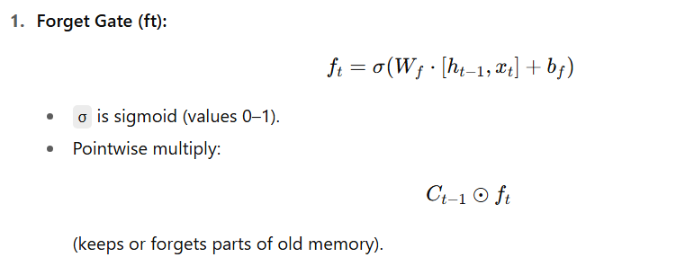
</p>

---

<p align="left">
  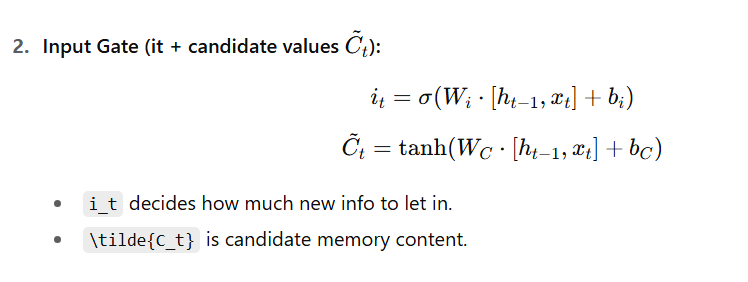
</p> 

---

<p align="left">
  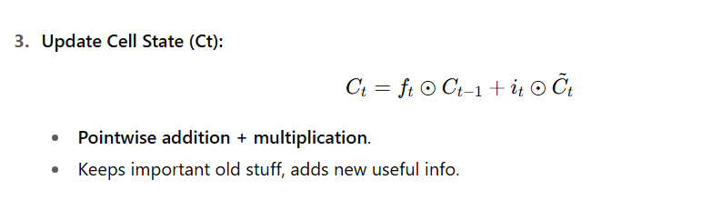
</p>

---

<p align="left">
  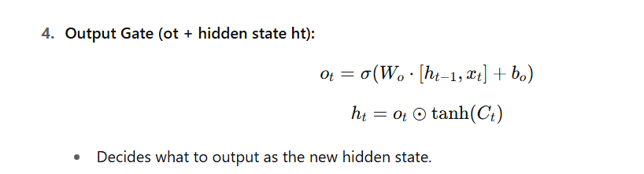
</p>

---

## 4. Key Operations in LSTM

- **Concatenation ([h<sub>t−1</sub>, x<sub>t</sub>]):**  
  Input vector and hidden state are joined into one long vector → fed into the gates.

- **Pointwise operations (⊙):**
  - Forget gate multiplies old cell state element by element.
  - Input gate multiplies candidate values element by element.
  - Output gate multiplies tanh(cell state) element by element.

- **Copying (Highway for memory):**  
  The **cell state (C)** is like a conveyor belt:
  - Information flows **forward in time** with some parts copied unchanged.
  - Only small adjustments happen through the gates.  
  This *copy mechanism* is why LSTMs remember long-term info so well.

---

## 5. Intuition Recap

- Neurons inside gates decide **what to keep/forget**.
- Vectors carry info: inputs, hidden state, memory.
- Concatenation merges input + hidden state.
- Pointwise ops make selective memory edits.
- Copying lets important info flow across many time steps.


---

**In one line:**  
LSTM is just an RNN where vectors flow through gates made of neurons, and using concatenation, pointwise math, and copying, it learns what info to remember or forget over time.

[LSTM RNN Folder](https://github.com/Moazzam-Siddiqui/COMPLETE-NLP-AND-DEEP-LEARNING/tree/main/LSTM%20RNN)

---

**Detailed Diagram of LSTM:**
<p align="left">
  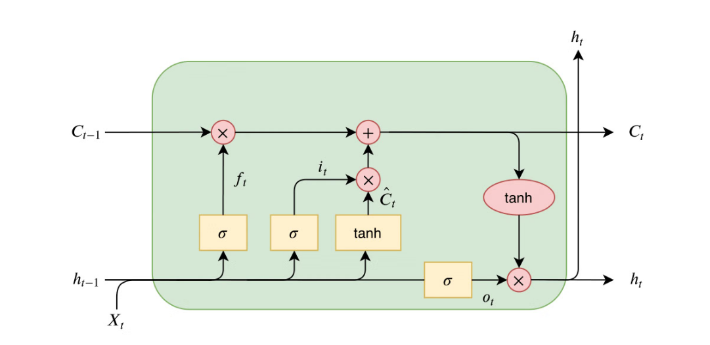
</p>

---

## Variants of LSTM RNN

### 1. Peephole Connection

We let the gate layers look at the **cell state**.  
Adds connections from the cell state **C<sub>t−1</sub>** into each gate (so gates “peek” at the cell).  
Improves timing/precision for tasks where exact counting/phase matters (e.g., timing signals, small-step counting).  
Slightly more parameters; may help in learning precise gating.

<p align="left">
  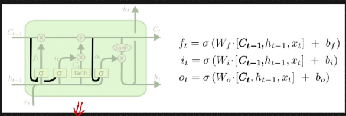
</p>

---
### 2. Combining Forget and Input Gates

Instead of separately deciding what to forget and what new information to add, we make this decision **together**.

**GOAL:** We only forget when we’re going to input something in its place.

So we only input new values to the state when we forget something older.

<p align="left">
  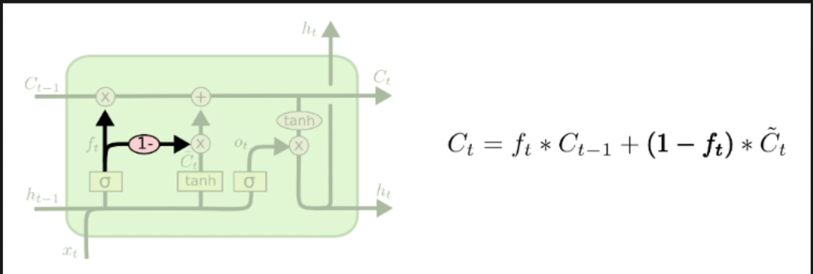
</p>

---

### 3.GRU(GATED RECURRENT UNIT) introduced by cho,et al in 2014:
<p align="left">
  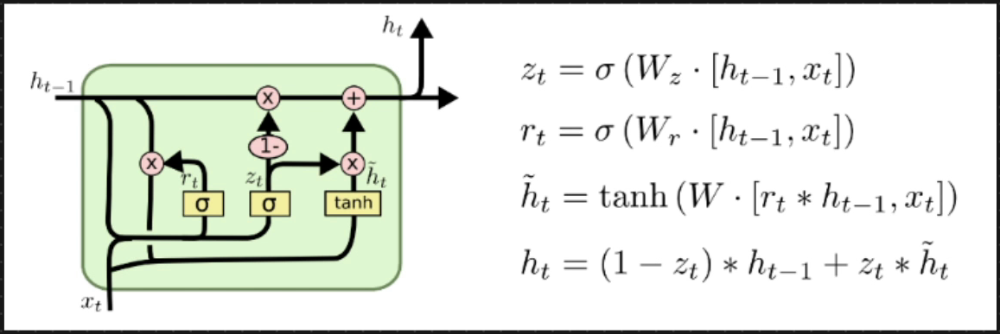
</p>


Always remember that the upper line **h<sub>t−1</sub>** represents **long-term memory**,  
while the lower one **x<sub>t</sub>** represents our **short-term memory**.

---

### Why use GRU instead of LSTM RNN?

LSTM RNN structure is quite complex, as it contains:
- Forget gate  
- Input gate + candidate memory  
- Output gate (each with its own pointwise operation)  

Let’s not forget the **trainable parameters** (weights and biases) involved as well.  
Assume our input size is around 100 and our hidden nodes are 100 — this means the number of trainable parameters increases rapidly.  
As these parameters grow, **training time increases** proportionally (since more parameters = longer forward and backward propagation time).

---

### GRU Simplification

In a **GRU (Gated Recurrent Unit)**, instead of using separate long-term and short-term memories,  
they **combine both memory cells** into one.

So, here **h<sub>t−1</sub>** represents a **single memory cell** — our hidden state.  
Within GRUs, operations and gating mechanisms are designed to simplify LSTM’s complexity while still retaining its memory capabilities.


## Mathematical Functioning

**1. Update Gate (Z<sub>t</sub>):**  
We calculate it as:  
**Z<sub>t</sub> = σ(W<sub>z</sub> · [h<sub>t−1</sub>, x<sub>t</sub>])**  

*(Summary: We perform a pointwise multiplication using update gate weights with the concatenated previous hidden state and current input, then apply the sigmoid activation function.)*

---

**2. Reset Gate (R<sub>t</sub>):**  
We calculate it as:  
**R<sub>t</sub> = σ(W<sub>r</sub> · [h<sub>t−1</sub>, x<sub>t</sub>])**  

*(Summary: Similar to the update gate — we multiply reset gate weights with [h<sub>t−1</sub>, x<sub>t</sub>] and apply sigmoid activation.)*

---

**3. Temporary Hidden State (~h<sub>t</sub>):**  
We calculate it as:  
**~h<sub>t</sub> = tanh(W · [R<sub>t</sub> * h<sub>t−1</sub>, x<sub>t</sub>])**  

*(Summary: The reset gate modifies the previous hidden state element-wise, then we concatenate it with the current input, apply weights, and finally use the tanh activation.)*

---

**4. Final Hidden State (h<sub>t</sub>):**  
We calculate it as:  
**h<sub>t</sub> = (1 − Z<sub>t</sub>) * h<sub>t−1</sub> + Z<sub>t</sub> * ~h<sub>t</sub>**  

*(Summary: The final hidden state is obtained by combining the previous hidden state and the temporary hidden state, weighted by the update gate.)*

Now, some of you might ask why we don’t see any **bias terms** in our update gate, reset gate, or temporary hidden state equations.  
Yes — we **do have biases**, and we add them in practice, but for simplicity in mathematical derivations, we often omit them.

---

## Understanding What Each State Does

### **Update Gate (z<sub>t</sub>) – “Keep old or take new?”**
Imagine your brain deciding:  
*Should I remember the old thing or learn the new thing?*  

- High z<sub>t</sub> → “Keep more of the new info.”  
- Low z<sub>t</sub> → “Stick with the old memory.”

---

### **Reset Gate (r<sub>t</sub>) – “Forget old or keep it?”**
When learning something new, *how much of the old memory should I use?*

- Low r<sub>t</sub> → “Forget old stuff, focus only on new.”  
- High r<sub>t</sub> → “Keep some old memory to help understand new info.”

---

### **Candidate / Temporary Hidden State (~h<sub>t</sub>) – “New idea”**
This represents the **new information** generated from the current input and (partially) the old memory.

---

### **Final Hidden State (h<sub>t</sub>) – “Final memory”**
This is the **mix of old memory and new idea**,  
decided by the update gate — ready to be passed forward to the next time step.

---

## 🧠 CHRONOLOGY SAMJHIYE (Understand the Chronology)

Your brain = **Instagram feed**

| Concept | Analogy |
|----------|----------|
| **Update gate** | Algorithm deciding if a new trend should appear on your feed |
| **Reset gate** | Algorithm deciding if old videos should be hidden or stay |
| **Candidate (~h<sub>t</sub>)** | New viral video ready to pop up |
| **Final hidden state (h<sub>t</sub>)** | Your feed right now — perfectly balanced |

---

